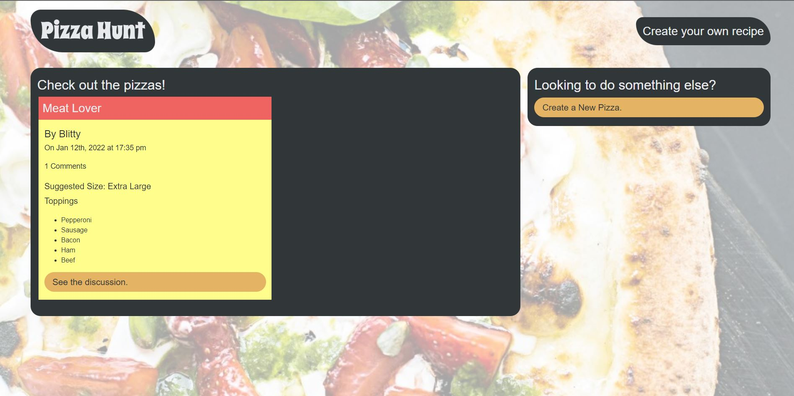

# Pizza-Hunt
   

## Description
Created with noSQL through the use of MongoDB and Mongoose. This allows the user to have persistent data and create Pizzas with other Pizza lovers. Comment and reply to discuss Pizza creations. 

## Table of Contents
* [Installation](#installation)
* [Usage](#usage)
* [Questions](#questions)
* [Contributions](#contributions)

## Installation
You must have some base knowledge with MongoDB, Heroku and MongoDB Atlas for this project to be deployed. To run locally you will just need to download the repo, install dependencies and ensure that you have MongoDB installed on your computer and the environment path created. 

## Usage
[PizzaHunt production link](https://pacific-thicket-18219.herokuapp.com/)

## Questions
Please visit my [GitHub profile](https://github.com/blitman12) for other cool projects
If you have any remaining questions please feel free to reach me at bradlitman94@gmail.com

## Contributions
Front End provided by University of Arizona BootCamp. Back end created by myself with the help of University of Arizona BootCamp

